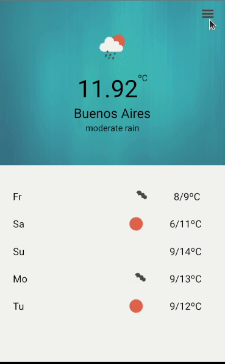

## Preview



## Main technologies used

- [React Native](https://github.com/facebook/react-native)

## Project Set Up

This project was bootstrapped with
[react-native-cli](https://reactnative.dev/docs/getting-started).

This project uses the [OpenWeather](https://openweathermap.org/), you need to create an
account, and add the API_KEY en the .env file. Furthermore, it uses
[ipapi](https://ipapi.co/) for getting the current location, you do not need to
create an account for this.

### ENV setup

create `.env` files on the root following its respective `.env.example` templates.

---

## Available Scripts

### `npm start`

Runs your app in development mode.

Sometimes you may need to reset or clear the React Native packager's cache. To do so, you can pass the `--reset-cache` flag to the start script:

```
npm start -- --reset-cache
# or
yarn start -- --reset-cache
```

#### `npm test`

Runs the [jest](https://github.com/facebook/jest) test runner on your tests.

#### `npm run ios`

Like `npm start`, but also attempts to open your app in the iOS Simulator if you're on a Mac and have it installed.

#### `npm run android`

Like `npm start`, but also attempts to open your app on a connected Android device or emulator. Requires an installation of Android build tools (see [React Native docs](https://facebook.github.io/react-native/docs/getting-started.html) for detailed setup). We also recommend installing Genymotion as your Android emulator. Once you've finished setting up the native build environment, there are two options for making the right copy of `adb` available to Create React Native App:

##### Using Android Studio's `adb`

1. Make sure that you can run adb from your terminal.
2. Open Genymotion and navigate to `Settings -> ADB`. Select “Use custom Android SDK tools” and update with your [Android SDK directory](https://stackoverflow.com/questions/25176594/android-sdk-location).
